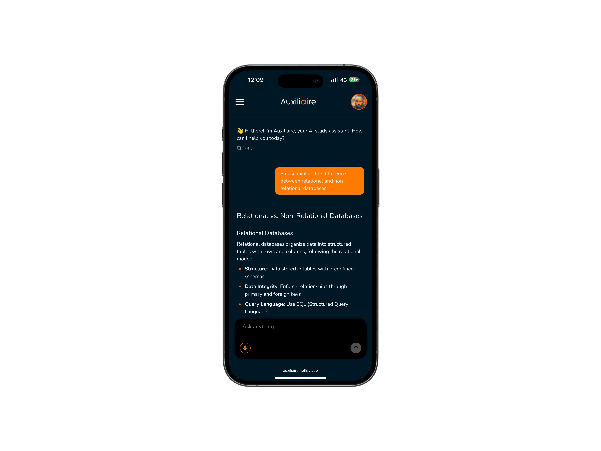
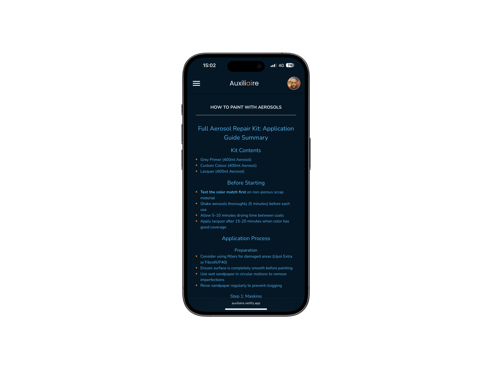
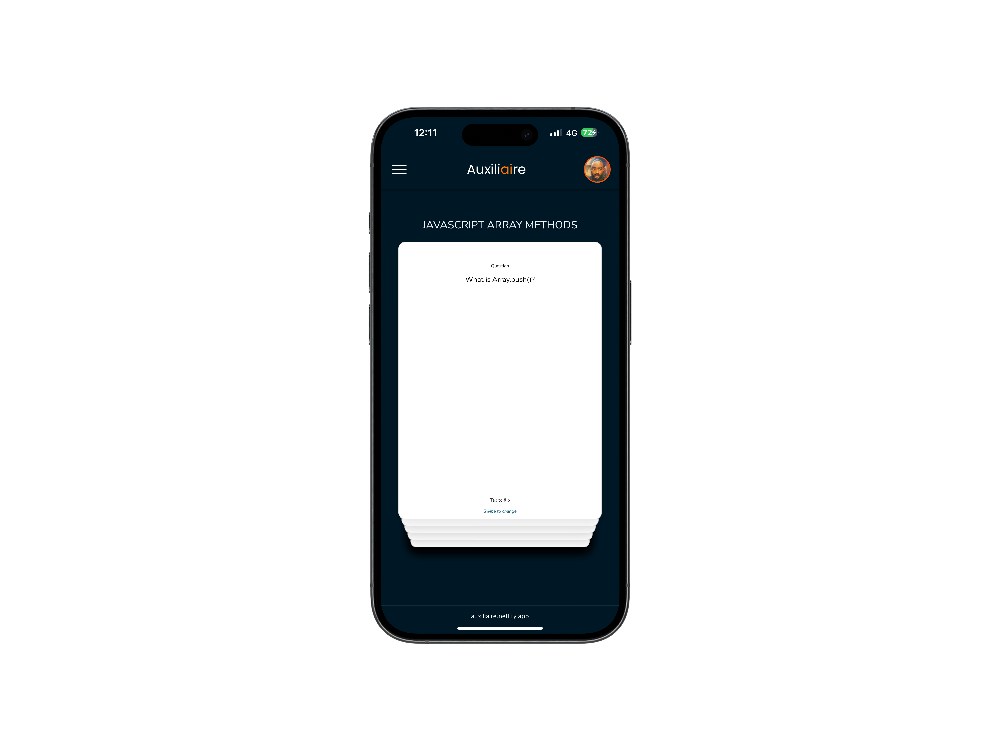

# Auxiliaire

An AI-powered study workspace that helps students turn course material into clear summaries, persistent tutoring conversations, and interactive flashcard decks.

[](https://auxiliaire.netlify.app)
[](https://react.dev/)
[](https://vite.dev/)
[](https://firebase.google.com/)
[](https://www.anthropic.com/claude)

## Overview

Auxiliaire brings several everyday study tools into one responsive application. Students can ask an AI tutor questions, upload notes for summarisation, generate flashcards, and return to saved study material across sessions.

**Live application:** [auxiliaire.netlify.app](https://auxiliaire.netlify.app)

## Screenshots

| AI tutor | Smart notes | Flashcards |
| --- | --- | --- |
|  |  |  |

## Features

- **AI tutor** — ask questions across academic subjects and receive structured, Markdown-formatted answers.
- **Persistent conversations** — save chat sessions in Firestore and continue them later.
- **Smart note summaries** — extract and summarise text from PDF, DOCX, and TXT files in the browser.
- **AI flashcards** — generate decks of 20–40 cards from a topic or directly from uploaded notes.
- **Interactive study decks** — review saved cards through an animated, swipeable card stack.
- **Personal study library** — keep notes, flashcard decks, and chat sessions organised by account.
- **Secure routes** — protect study content behind Firebase Authentication.
- **Flexible sign-in** — use email/password authentication or Google sign-in.
- **Responsive interface** — study across mobile and desktop layouts, with light and dark themes.
- **Readable AI output** — render GitHub-flavoured Markdown with highlighted code blocks and copy controls.

> Quiz generation is represented in the interface but is not yet implemented. See the [roadmap](#roadmap).

## Tech Stack

| Area | Technologies |
| --- | --- |
| Frontend | React 19, Vite 6, React Router |
| Styling and motion | Tailwind CSS 4, CSS, Material UI, Framer Motion |
| AI | Anthropic SDK, Claude |
| Authentication and data | Firebase Authentication, Cloud Firestore |
| File processing | PDF.js, Mammoth, FileReader API |
| Content rendering | React Markdown, Remark GFM, Rehype Highlight |
| Utilities | Day.js, UUID, React Use Gesture |
| Deployment | Netlify |

## How It Works

1. A student signs in with email/password or Google.
2. The React client reads and writes that student's sessions, notes, and flashcard decks in Firestore.
3. Questions and extracted note text are sent to Claude for tutoring, summarisation, or flashcard generation.
4. PDF, DOCX, and TXT content is extracted locally in the browser before AI processing.
5. Generated study material is saved under the authenticated user's Firestore document for later access.

### Firestore structure

```text
users/{userId}
├── sessions/{sessionId}
├── notes/{noteId}
└── flashcards/{deckId}
```

## Getting Started

### Prerequisites

- [Node.js](https://nodejs.org/) 20 or later
- npm
- A [Firebase](https://firebase.google.com/) project
- An [Anthropic API key](https://console.anthropic.com/)

### 1. Clone the repository

```bash
git clone https://github.com/bryanwaine/AI-Study-Assistaant.git
cd AI-Study-Assistaant
```

### 2. Install dependencies

```bash
npm install
```

### 3. Configure Firebase

In the Firebase console:

1. Create or select a Firebase project and register a web app.
2. Enable **Email/Password** and **Google** in Authentication.
3. Create a Cloud Firestore database.
4. Add Firestore security rules that restrict each user's study data to that authenticated user.

### 4. Add environment variables

Create a `.env.local` file in the project root:

```env
VITE_FIREBASE_API_KEY=your_firebase_api_key
VITE_FIREBASE_AUTH_DOMAIN=your_project.firebaseapp.com
VITE_FIREBASE_PROJECT_ID=your_project_id
VITE_FIREBASE_STORAGE_BUCKET=your_project.firebasestorage.app
VITE_FIREBASE_MESSAGING_SENDER_ID=your_messaging_sender_id
VITE_FIREBASE_APP_ID=your_app_id
VITE_FIREBASE_MEASUREMENT_ID=your_measurement_id
VITE_ANTHROPIC_API_KEY=your_anthropic_api_key
```

The Firebase measurement ID is optional while Analytics remains disabled. Do not commit `.env.local`.

### 5. Start the development server

```bash
npm run dev
```

Open the local URL shown by Vite, normally [http://localhost:5173](http://localhost:5173).

## Available Scripts

| Command | Purpose |
| --- | --- |
| `npm run dev` | Start the Vite development server |
| `npm run build` | Create an optimised production build in `dist/` |
| `npm run preview` | Preview the production build locally |
| `npm run lint` | Run ESLint across the project |

## Project Structure

```text
AI-Study-Assistaant/
├── public/
│   └── images/              # Static images and app previews
├── src/
│   ├── components/          # Reusable UI and study components
│   ├── context/             # React context definitions
│   ├── hooks/               # Authentication and UI hooks
│   ├── pages/               # Route-level screens
│   ├── routes/              # Protected-route handling
│   ├── utils/               # Firestore services and helpers
│   ├── anthropic.js         # Claude prompts and API requests
│   ├── firebase.js          # Firebase client configuration
│   └── App.jsx              # Application routes
├── package.json
└── vite.config.js
```

## Security Note

Vite exposes every variable prefixed with `VITE_` to browser code. Firebase web configuration is designed to be public, but access to Firestore must be protected with correctly scoped security rules.

The current application also calls Anthropic directly from the browser using `VITE_ANTHROPIC_API_KEY`. Treat that approach as local-development only. Before deploying your own production instance, move Anthropic requests behind a trusted backend or serverless function, keep the API key server-side, and add authentication, rate limiting, and usage controls.

## Deployment

For a standard Vite deployment:

- Build command: `npm run build`
- Publish directory: `dist`

When deploying a single-page application, configure the host to redirect unmatched paths to `/index.html` so client-side routes load correctly.

## Roadmap

- [x] AI tutoring conversations
- [x] Persistent chat history
- [x] Note upload and AI summaries
- [x] Topic- and note-based flashcards
- [x] Firebase authentication and Firestore persistence
- [x] Responsive light and dark themes
- [ ] AI-generated quizzes and saved quiz attempts
- [ ] Server-side proxy for AI requests
- [ ] Automated unit, integration, and end-to-end tests

## Author

Built by [Bryan Ezeaka](https://github.com/bryanwaine).

Feedback and contributions are welcome.
